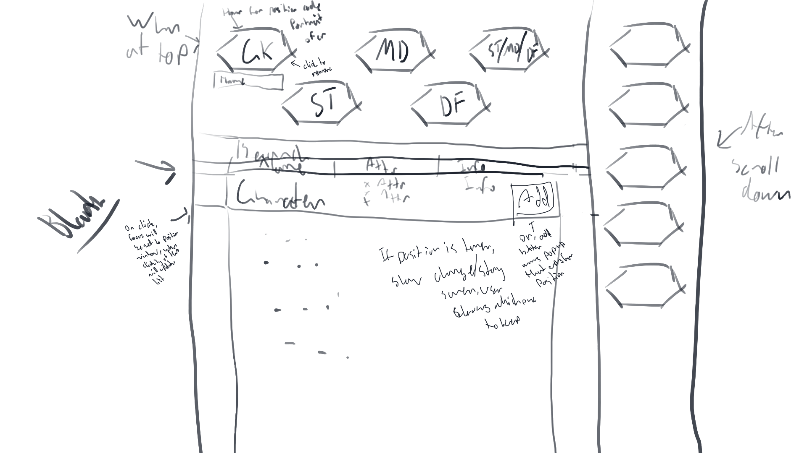
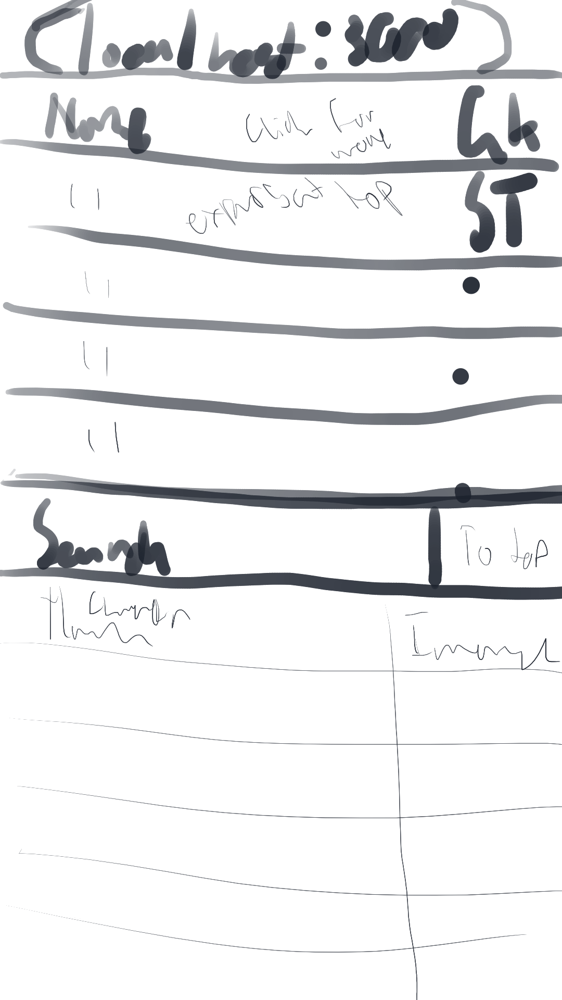

# marvel_soccer_team
React app that allows the user to create a 5-aside soccer team from Marvel Comics characters.

# API Key
- Ensure that a file called `public_key.js` is created and placed in the `src` folder, with the format:
```
export const public_key = 'public-key-here';
```
- Go to https://developer.marvel.com/ for a key
- Only the one line is necessary for the system to work. If you'd like my public key for the API, let me know.

# Ideas
- Basic, keep simple, don't overthink
- Single Page Application
- Team Members
  - 1 Goalkeeper (GK)
  - 1 Striker (ST)
  - 1 Midfielder (MD)
  - 1 Defender (DF)
  - 1 ST, MD, or DF
- Basically, show blank team at top/side of page (when scrolled down)
- Show list of characters and be able to search by name
- List headings should toggle between numbered order, alphabetical, and reverse-alphabetical
- Include save to file, maybe simple social media integration

- See design sketches:
<details>

  - Desktop (v0.1)


  - Mobile (v0.1)


</details>

# Mid-Project Notes
- Rough start, getting used to using react again
- Finally figured out my information flow, and it seems to be working.
- Could probably cut down on API requests by making pages larger, will have to look into that.
- Stick heading works for both mobile and web, plus sticky footer and spacing is figured out
- Need to validate team details, and create modals that let you view information/add/remove characters from your team
- Share button? Could probably put a share button in the footer

- Instead of going with a modal, going to make another selection pane
  - detailed view, which will have the options to add under a certain position

## Final To-do List
- Be able to remove characters from selection
- Selection for specific Positions (with checking)
- Display detailed info
- Share button
- Fix up mobile representation

# Further Notes
- Things are working, now just need to do team validation
  - I think it might be good to go for a set of default values for the buttons, that are replaced with the actual characters once selected.
- Share button is lacking a space. Maybe at the bottom of every page would be good.
- Other ideas?
- Also need to clean up the whole thing with CSS.


### Default create-react-app readme
<details>

# Getting Started with Create React App

This project was bootstrapped with [Create React App](https://github.com/facebook/create-react-app).

## Available Scripts

In the project directory, you can run:

### `npm start`

Runs the app in the development mode.\
Open [http://localhost:3000](http://localhost:3000) to view it in the browser.

The page will reload if you make edits.\
You will also see any lint errors in the console.

### `npm test`

Launches the test runner in the interactive watch mode.\
See the section about [running tests](https://facebook.github.io/create-react-app/docs/running-tests) for more information.

### `npm run build`

Builds the app for production to the `build` folder.\
It correctly bundles React in production mode and optimizes the build for the best performance.

The build is minified and the filenames include the hashes.\
Your app is ready to be deployed!

See the section about [deployment](https://facebook.github.io/create-react-app/docs/deployment) for more information.

### `npm run eject`

**Note: this is a one-way operation. Once you `eject`, you can’t go back!**

If you aren’t satisfied with the build tool and configuration choices, you can `eject` at any time. This command will remove the single build dependency from your project.

Instead, it will copy all the configuration files and the transitive dependencies (webpack, Babel, ESLint, etc) right into your project so you have full control over them. All of the commands except `eject` will still work, but they will point to the copied scripts so you can tweak them. At this point you’re on your own.

You don’t have to ever use `eject`. The curated feature set is suitable for small and middle deployments, and you shouldn’t feel obligated to use this feature. However we understand that this tool wouldn’t be useful if you couldn’t customize it when you are ready for it.

## Learn More

You can learn more in the [Create React App documentation](https://facebook.github.io/create-react-app/docs/getting-started).

To learn React, check out the [React documentation](https://reactjs.org/).

### Code Splitting

This section has moved here: [https://facebook.github.io/create-react-app/docs/code-splitting](https://facebook.github.io/create-react-app/docs/code-splitting)

### Analyzing the Bundle Size

This section has moved here: [https://facebook.github.io/create-react-app/docs/analyzing-the-bundle-size](https://facebook.github.io/create-react-app/docs/analyzing-the-bundle-size)

### Making a Progressive Web App

This section has moved here: [https://facebook.github.io/create-react-app/docs/making-a-progressive-web-app](https://facebook.github.io/create-react-app/docs/making-a-progressive-web-app)

### Advanced Configuration

This section has moved here: [https://facebook.github.io/create-react-app/docs/advanced-configuration](https://facebook.github.io/create-react-app/docs/advanced-configuration)

### Deployment

This section has moved here: [https://facebook.github.io/create-react-app/docs/deployment](https://facebook.github.io/create-react-app/docs/deployment)

### `npm run build` fails to minify

This section has moved here: [https://facebook.github.io/create-react-app/docs/troubleshooting#npm-run-build-fails-to-minify](https://facebook.github.io/create-react-app/docs/troubleshooting#npm-run-build-fails-to-minify)

</details>

